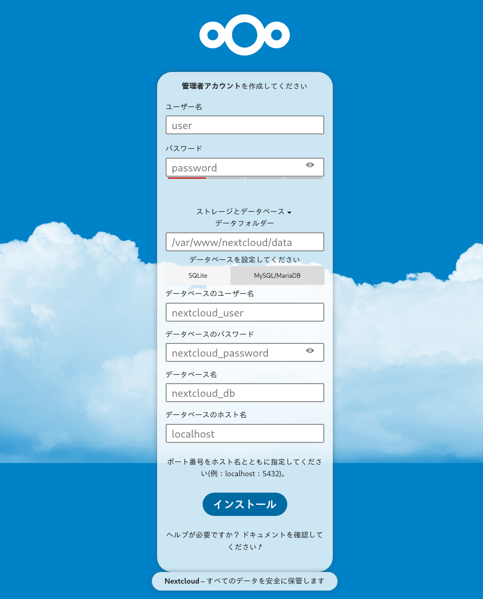

# はじめに
以下に各コンテナの説明や環境の設定を記載

## 全体設定
|名称|値|備考|
|:-:|:-:|:-:|
|ポッド名|file|ポッド作成時に設定|

## nginx container
web
|名称|値|備考|
|:-:|:-:|:-:|
|localtime|Asia/Tokyo|
|`CONFIG_FILE`|-|`--build-arg`により設定|

コンテナ起動時、以下のように変数を設定することでwebサーバの設定を変更可能  
(デフォルトでは[公式サイトの設定ファイル](https://raw.githubusercontent.com/nextcloud/documentation/master/admin_manual/installation/nginx-root.conf.sample)が設定されているため、自身の環境用に設定の変更が必須)  
```bash
podman build --build-arg CONFIG_FILE=$HOME/custom.conf --tag file-nginx:$TagName --file nginx/Dockerfile .
```

## php container
php-fpm

|名称|値|備考|
|:-:|:-:|:-:|
|localtime|Asia/Tokyo|
|socket|`/sock/www.sock`|

## mariadb container
データベース

|名称|値|備考|
|:-:|:-:|:-:|
|localtime|Asia/Tokyo|
|socket|`/sock/mysql.sock`|
|DB root password|password|`Dockerfile`にて設定|
|nextcloud DB name|nextcloud_db|`nextcloud.sql`にて設定|
|nextcloud DB user|nextcloud_user|`nextcloud.sql`にて設定|
|nextcloud DB password|nextcloud_password|`nextcloud.sql`にて設定|

## postfix container
メール配送

|名称|値|備考|
|:-:|:-:|:-:|
|localtime|Asia/Tokyo|

## redis container
キャッシュ

|名称|値|備考|
|:-:|:-:|:-:|
|localtime|Asia/Tokyo|
|socket|`/sock/redis.sock`|

# 実行スクリプト

## 各種コンテナの起動
ブランチの切り替えにより、alpineをベースとしたイメージにも変更可能

```bash
cd file_podman

# nextcloud本体のダウンロード
curl https://download.nextcloud.com/server/releases/latest.tar.bz2 -o $HOME/latest.tar.bz2

# タグの名称を設定
TagName="main"

# ボリュームの作成
podman volume create file_nginx_dir
bunzip2 -k -c $HOME/latest.tar.bz2 |
    podman volume import file_nginx_dir -
podman volume create file_mariadb_dir

# ポッドの作成
podman pod create --replace --publish 80:80 --publish 443:443 --network=slirp4netns:port_handler=slirp4netns --name file

#nginx
podman build --tag file-nginx:$TagName --file nginx/Dockerfile .
podman run --detach --replace --mount type=volume,source=file_nginx_dir,destination=/var/www --pod file --name file-nginx file-nginx:$TagName

# php
podman build --tag file-php:$TagName --file php/Dockerfile .
podman run --detach --replace --volumes-from file-nginx --pod file --name file-php file-php:$TagName

# mariadb
podman build --tag file-mariadb:$TagName --file mariadb/Dockerfile .
podman run --detach --replace --volumes-from file-nginx --mount type=volume,source=file_mariadb_dir,destination=/var/lib/mysql --pod file --name file-mariadb file-mariadb:$TagName

# redis
podman build --tag file-redis:$TagName --file redis/Dockerfile .
podman run --detach --replace --volumes-from file-nginx --pod file --name file-redis file-redis:$TagName

# postfix
podman build --tag file-postfix:$TagName --file postfix/Dockerfile .
podman run --detach --replace --pod file --name file-postfix file-postfix:$TagName

```

## nextcloudの初期設定
CUIまたはGUIによる初期設定を行う
### [CUIによる設定](https://docs.nextcloud.com/server/27/admin_manual/installation/command_line_installation.html)
以下を実行
```bash
ADMIN_NAME=admin
ADMIN_PASS=password
podman exec file-php occ maintenance:install \
--database='mysql' --database-name='nextcloud_db' \
--database-user='nextcloud_user' --database-pass='nextcloud_password' \
--admin-user=$ADMIN_NAME --admin-pass=$ADMIN_PASS
unset ADMIN_NAME ADMIN_PASS
```
### [GUIによる設定](https://docs.nextcloud.com/server/27/admin_manual/installation/installation_wizard.html)
1. `https://192.168.100.100`にアクセス
1. 以下の通り設定  
  

## `信頼できないドメインを介したアクセス`と表示された場合
```bash
# 現在の値の確認
podman exec file-php occ config:system:get trusted_domains

TRUSTED_DOMAIN="your IP or domain"
#何個目のドメインとして登録するかを指定
VAL=0

podman exec file-php occ config:system:set trusted_domains $VAL --value $TRUSTED_DOMAIN
```

## 自動起動の設定
```sh
# rootコンテナの場合
sudo podman generate systemd -f -n --new --restart-policy=on-failure file >tmp.service
cat tmp.service | \
xargs -I {} sudo cp {} -frp /etc/systemd/system/
sed -e "s/.*\///g" tmp.service | \
grep pod | \
xargs -n 1 sudo systemctl --now enable

# rootlessコンテナの場合
podman generate systemd -f -n --new --restart-policy=on-failure file >tmp.service
mkdir -p ~/.config/systemd/user/
cat tmp.service | \
xargs -I {} cp {} -frp ~/.config/systemd/user/
sed -e "s/.*\///g" tmp.service | \
grep pod | \
xargs -n 1 systemctl --user enable --now
```

## 自動起動解除
```sh
# rootコンテナの場合
sed -e "s/.*\///g" tmp.service | \
grep pod | \
xargs -n 1 sudo systemctl --user disable --now

# rootlessコンテナの場合
sed -e "s/.*\///g" tmp.service | \
grep pod | \
xargs -n 1 systemctl --user disable --now
```
